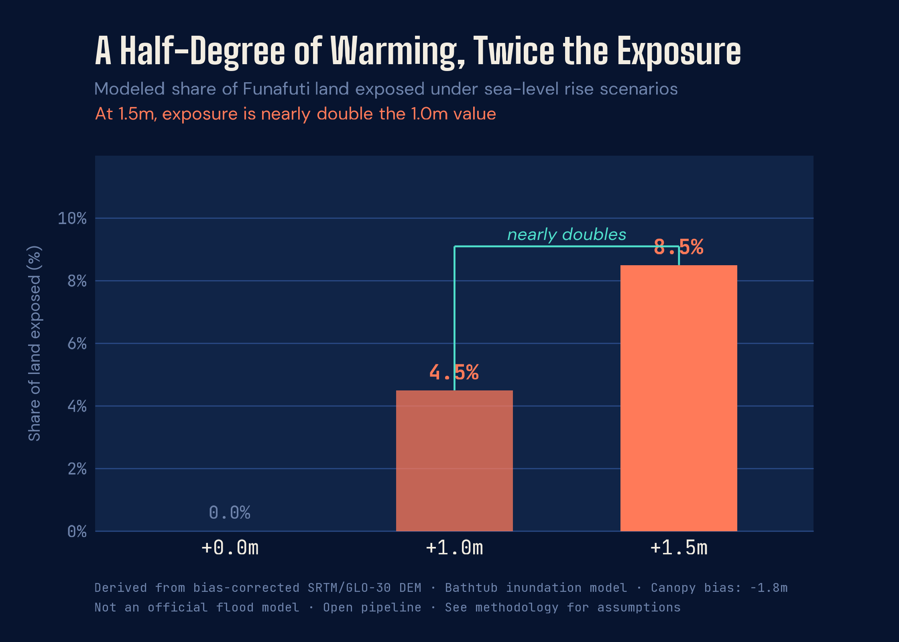

# Funafuti Atoll

<div class="header-row">
  <div class="eyebrow">SEA LEVEL RISE · TUVALU · PACIFIC DATAVIZ CHALLENGE 2026</div>
  
</div>

<div class="standfirst">
  <p>Funafuti Atoll, home to most of Tuvalu's population, rises only a few meters above the Pacific Ocean.</p>
  <p>The difference between 1°C and 1.5°C of global warming is often described as incremental. On low-lying atolls, it can become geographic. The scenarios below are illustrative thresholds, not precise projections — see the methodology.</p>
</div>

:::{.cr-section}

:::{#cr-baseline}

:::

Funafuti is not a block of land. It is a thin ring of motu around a lagoon — narrow, fragmented, and already close to the ocean. @cr-baseline

Look at the width of the land. In many places, the reef strips are narrower than a city block.

At one meter of sea-level rise, the edges begin to fail first. The exposed land is still measured in single digits — but the pattern has changed. @cr-slr10

:::{#cr-slr10}

:::

The difference between these two scenarios is roughly comparable to the difference between 1°C and 1.5°C of global warming.

By 1.5 meters, the story is no longer just edge loss. The connecting strips between motu begin to fragment — and exposure nearly doubles. @cr-slr15

:::{#cr-slr15}

:::

:::

---

<div class="methodology numbers-behind">

## The Numbers Behind the Maps

The bathtub model that generated the maps above also yields a direct exposure
estimate. The jump from 1.0m to 1.5m — the gap between a 1°C and a 1.5°C
warming trajectory — nearly doubles the share of Funafuti land at flood risk.



</div>

---

<div class="methodology">

## Methodology

This piece uses elevation data from the Copernicus GLO-30 Digital Elevation Model,
accessed via the `elevatr` R package. GLO-30 is a 30-meter resolution global DEM
derived from TanDEM-X radar data. For low-lying atoll environments, radar-derived
DEMs systematically overestimate land elevation because the radar return includes
vegetation canopy rather than bare ground. A uniform correction of −1.8m was applied
to all land pixels to partially compensate for this bias. This correction is an
approximation: canopy height varies across the atoll and the true correction is not
spatially uniform.

Flood extents were derived using a bathtub inundation model — any land pixel with
corrected elevation at or below the sea-level rise threshold is classified as exposed.
The bathtub model assumes static, connected inundation and does not account for
wave dynamics, storm surge, groundwater intrusion, or sediment transport. It
represents a low-elevation exposure threshold, not a flood prediction. Flood
pixels in the rendered maps are expanded by one grid cell outward for visual
legibility; the percentage figures in the subtitles reflect the methodologically
correct threshold without this display expansion.

Three scenarios are shown: 0.0m (current baseline), 1.0m, and 1.5m of sea-level
rise. The relationship between global mean temperature and sea-level rise is
nonlinear and scenario-dependent; the 1.0m and 1.5m scenarios are used here as
illustrative thresholds, not as precise projections for specific warming levels.

Coastline geometry is sourced from OpenStreetMap via the `osmextract` package.
All analysis was conducted in R using the `terra` and `sf` spatial packages.
Maps were rendered with `ggplot2` and `tidyterra`. The full pipeline is
open and reproducible.

<div class="data-sources">
  <div class="eyebrow">DATA SOURCES</div>
  <ul>
    <li>Copernicus GLO-30 Digital Elevation Model (ESA / DLR), accessed via the <code>elevatr</code> R package. Public domain.</li>
    <li>OpenStreetMap coastline geometry, via <code>osmextract</code> / Geofabrik. © OpenStreetMap contributors, ODbL 1.0.</li>
    <li>Derived flood-exposure scenarios at 0.0m, 1.0m, and 1.5m sea-level rise, produced by the author using the bathtub inundation model described above.</li>
    <li>Atoll canopy-height correction informed by Yamano et al. (2007) and Tuck et al. (2019).</li>
    <!-- SPC dataset line — uncomment and populate once the official June 1 2026 list is published
    <li>Pacific Community (SPC) Pacific Data Hub: [dataset name and URL].</li>
    -->
  </ul>
</div>

<div class="tools-block">
  <div class="eyebrow">TOOLS</div>
  <p class="tools-text">R · Quarto · Closeread v1.0.1 · ggplot2 · ggtext · showtext · terra · sf · tidyterra · elevatr · osmextract · patchwork</p>
</div>

</div>

<div class="eyebrow" style="margin-top: 2rem;">NOT AN OFFICIAL FLOOD FORECAST · OPEN PIPELINE · REPRODUCIBLE IN R</div>

<div class="licence-block">
  <div class="eyebrow">LICENCE</div>
  <p class="licence-text">This work — code, narrative, and derived visualisations — is licensed under <a href="https://creativecommons.org/licenses/by/4.0/">CC BY 4.0</a>. You are free to share and adapt with attribution. OpenStreetMap-derived geometry remains under <a href="https://opendatacommons.org/licenses/odbl/">ODbL 1.0</a>; the Copernicus GLO-30 DEM is in the public domain.</p>
</div>

---

<div class="footer-line">
  <span style="color: #F2EDE2; font-weight: 500;">Steven Ponce</span>
  <span>·</span>
  <span>Data Analyst &amp; R/Shiny Developer</span>
  <span>·</span>
  <span>Pacific Dataviz Challenge 2026</span>
</div>

<div class="footer-links">
  <a href="https://www.linkedin.com/in/stevenponce/">LinkedIn</a>
  <span>·</span>
  <a href="https://bsky.app/profile/sponce1.bsky.social">Bluesky</a>
  <span>·</span>
  <a href="https://github.com/poncest">GitHub</a>
  <span>·</span>
  <a href="https://stevenponce.netlify.app">stevenponce.netlify.app</a>
</div>

```{=html}
<script>
// Manual scroll-based sticky swap.
// Required workaround for Closeread v1.0.1 + Scrollama initialization
// timing issue. Scrollama fires before layout is complete and misses
// triggers already in the viewport on load. This script replaces
// Scrollama's stepEnter logic with a direct scroll listener that
// applies cr-active to the correct sticky on every scroll event.
//
// Logic: matches Closeread's offset: 0.5 — a trigger is "active" when
// its top has crossed the 50% viewport mark. The last such trigger wins.
//
// DO NOT REMOVE. DO NOT REPLACE WITH scrollama.resize() calls.
// Tested: Closeread v1.0.1, Quarto 1.6.x, Windows, Chrome.

window.addEventListener('load', function() {

  var triggers = Array.from(document.querySelectorAll('.trigger[data-focus-on]'));
  var stickies = document.querySelectorAll('.sticky');

  function getActiveTarget() {
    var midpoint = window.innerHeight * 0.5;
    var active = null;
    triggers.forEach(function(t) {
      var rect = t.getBoundingClientRect();
      if (rect.top <= midpoint) {
        active = t.getAttribute('data-focus-on');
      }
    });
    return active;
  }

  function updateStickies() {
    var activeId = getActiveTarget();
    stickies.forEach(function(s) {
      if (s.id === activeId) {
        s.classList.add('cr-active');
      } else {
        s.classList.remove('cr-active');
      }
    });
  }

  window.addEventListener('scroll', updateStickies);
  setTimeout(updateStickies, 200);
});
</script>
```
