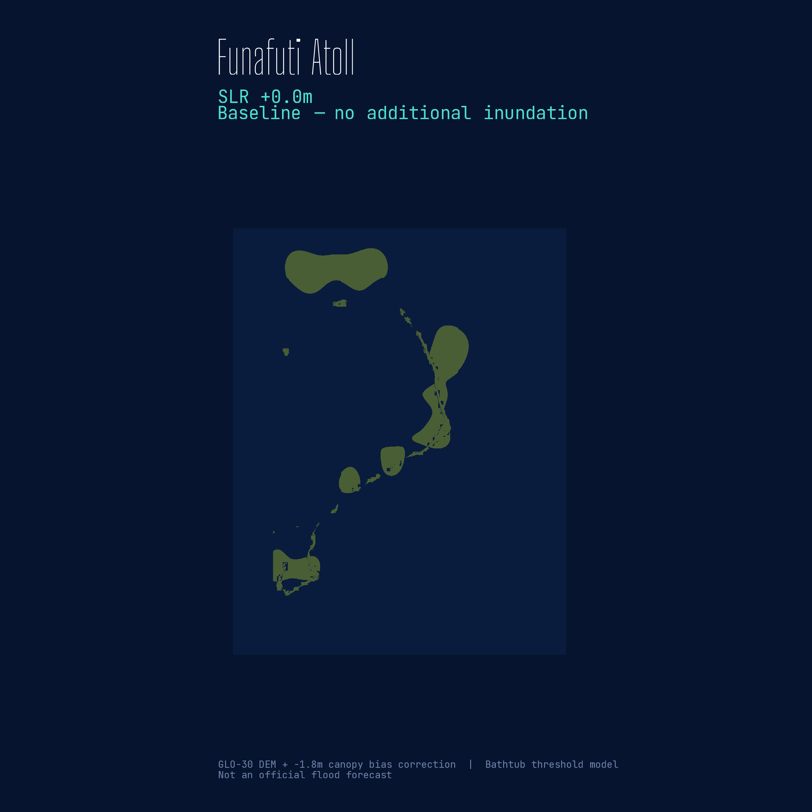
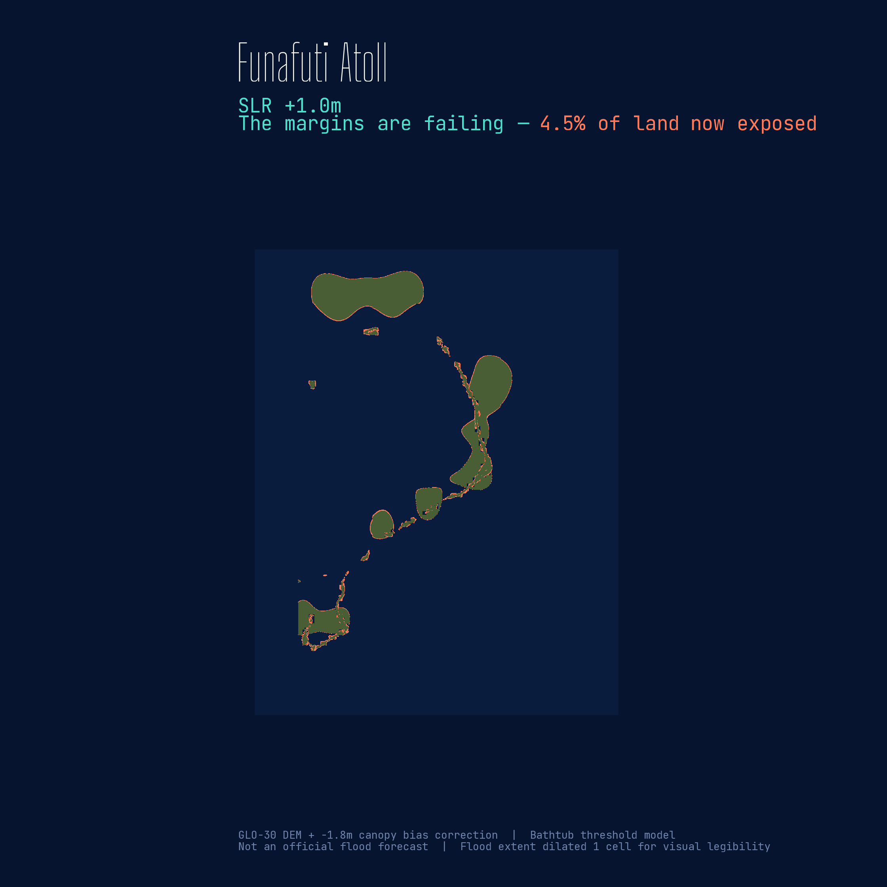

# Funafuti Atoll

<div class="eyebrow">SEA LEVEL RISE · TUVALU · PACIFIC DATAVIZ CHALLENGE 2026</div>

For Tuvalu, the difference between 1°C and 1.5°C of warming is not a number — it is the island.

:::{.cr-section}

:::{#cr-baseline}

:::

Funafuti is not a block of land. It is a thin ring of motu around a lagoon — narrow, fragmented, and already close to the ocean. @cr-baseline

At one meter of sea-level rise, the edges begin to fail first. The most exposed strips are not gone all at once, but their usable margins shrink. @cr-slr10

:::{#cr-slr10}

:::

By 1.5 meters, the pattern changes from edge loss to fragmentation. The connectors between motu become the weak points. @cr-slr15

:::{#cr-slr15}

:::

:::

---

*Methodology note to be added here.*

```{=html}
<script>
// Manual scroll-based sticky swap.
// Bypasses Scrollama initialization timing issues.
// Reads trigger positions on each scroll event and activates
// the correct sticky based on which trigger is above the
// 50% viewport mark — matching Closeread's offset: 0.5 logic.

window.addEventListener('load', function() {

  // Map each trigger to its target sticky ID
  var triggers = Array.from(document.querySelectorAll('.trigger[data-focus-on]'));
  var stickies = document.querySelectorAll('.sticky');

  function getActiveTarget() {
    var midpoint = window.innerHeight * 0.5;
    var active = null;
    triggers.forEach(function(t) {
      var rect = t.getBoundingClientRect();
      // Trigger is active if its top has crossed the midpoint
      if (rect.top <= midpoint) {
        active = t.getAttribute('data-focus-on');
      }
    });
    return active;
  }

  function updateStickies() {
    var activeId = getActiveTarget();
    stickies.forEach(function(s) {
      if (s.id === activeId) {
        s.classList.add('cr-active');
      } else {
        s.classList.remove('cr-active');
      }
    });
  }

  // Run on scroll
  window.addEventListener('scroll', updateStickies);

  // Run once on load to activate first visible trigger
  setTimeout(updateStickies, 200);
});
</script>
```
