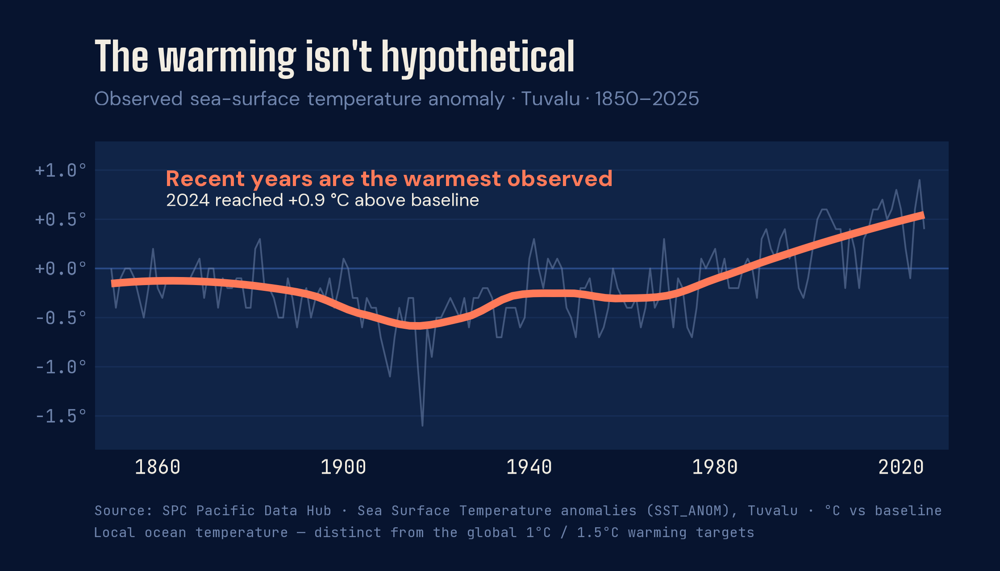
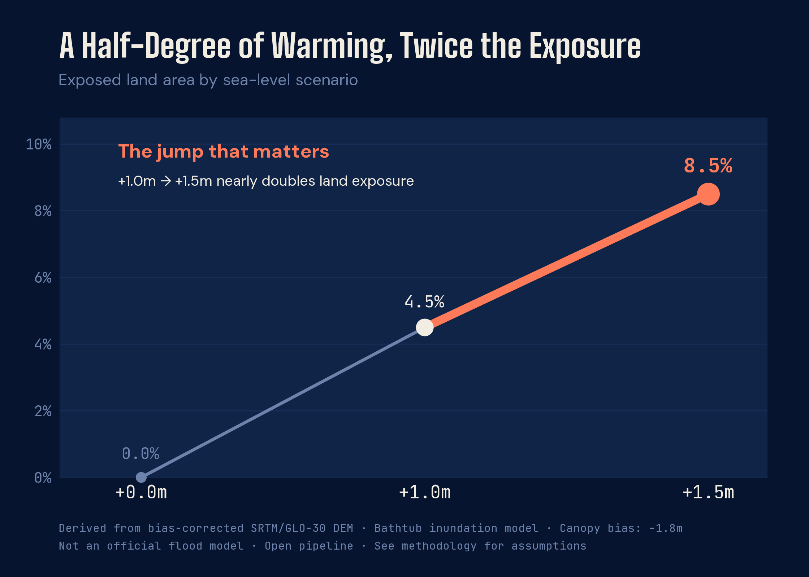

# What Sits in the Difference

<div class="header-row">
  <div class="eyebrow">FUNAFUTI, TUVALU · SEA-LEVEL RISE (SLR) THRESHOLDS</div>
  
</div>

<div class="standfirst">
  <p>For Tuvalu, the difference between 1°C and 1.5°C of warming is not a number — it's the island.</p>
  <p>On Funafuti, home to most of Tuvalu's people, the largest open space is the airport runway. Most evenings, when no flight is due, it fills with football, cycling, and families in the cooling air, because on an atoll this narrow there is nowhere else with room.</p>
  <p>It is the widest flat ground on the island, and it rises only a few meters above the water — ocean on one side, the lagoon on the other. Half a degree of warming sounds incremental; on ground this low, it can become geographic.</p>
  <p>The scenarios below are illustrative thresholds, not precise projections. See the methodology for assumptions and limitations.</p>
</div>

Those thresholds are scenarios. The trend beneath them is not. Around Tuvalu, sea-surface temperatures have climbed out of more than a century of cooler readings.

<div class="sst-figure">

</div>

A warmer ocean is a higher one — expanding as it heats, and fed by ice melting far away. What that added height would mean for ground this low is the question the next three maps put to the atoll itself.

:::{.cr-section}

:::{#cr-baseline}
{fig-alt="Map of Funafuti Atoll at current sea level: a thin, fragmented ring of low islets around a central lagoon, with no additional land flagged as exposed."}
:::

Funafuti is not a block of land. It is a thin ring of motu around a lagoon — narrow, fragmented, and already close to the ocean. @cr-baseline

Look at the width of the land. In many places, the reef strips are narrower than a city block.

At one meter of sea-level rise, the edges begin to fail first. The exposed land is still measured in single digits — but the pattern has changed. @cr-slr10

:::{#cr-slr10}
{fig-alt="The same atoll under 1.0m of sea-level rise: the narrow outer edges of the islets flagged as exposed (about 4.5% of land area), the ring still largely connected."}
:::

The step from one meter to one and a half meters is roughly comparable to the difference between 1°C and 1.5°C of global warming.

By 1.5 meters, the story is no longer just edge loss. The connecting strips between motu begin to fragment — and exposure nearly doubles. @cr-slr15

:::{#cr-slr15}
{fig-alt="The same atoll under 1.5m of sea-level rise: exposure spreading inward and the strips connecting the islets breaking up, about 8.5% of land area, nearly double the 1.0m figure."}
:::

:::

---

<div class="methodology">

## The Numbers Behind the Maps

The maps show where. This chart shows how much more. Between 1.0m and 1.5m of
rise, the exposed share of Funafuti's land nearly doubles.

{fig-alt="Slope chart titled A Half-Degree of Warming, Twice the Exposure: exposed land area rises from 0 percent at current sea level to 4.5 percent at 1.0m and 8.5 percent at 1.5m of sea-level rise, nearly doubling between the two scenarios."}

</div>

<div class="closing-coda">

The distance between these scenarios is half a degree. It sounds small. On an atoll this narrow, it becomes geography.

The maps do not show a fate sealed. They show one still open.

Tuvalu is what sits in the difference.

</div>

---

<div class="methodology">

## Methodology

This piece uses elevation data accessed via the `elevatr` R package, which returns
AWS Open Data Terrain Tiles — a composite global terrain model assembled from open
elevation sources at roughly 30-meter resolution. Like most global terrain models,
it represents the reflective surface (including vegetation canopy) rather than bare
ground, so it systematically overestimates land elevation in vegetated, low-lying
environments such as atolls. A uniform correction of −1.8m was applied
to all land pixels to partially compensate for this bias. This correction is an
approximation: canopy height varies across the atoll and the true correction is not
spatially uniform.

Flood extents were derived using a bathtub inundation model — any land pixel with
corrected elevation at or below the sea-level rise threshold is classified as exposed.
The bathtub model assumes static, connected inundation and does not account for
wave dynamics, storm surge, groundwater intrusion, or sediment transport. It
represents a low-elevation exposure threshold, not a flood prediction. Flood
pixels in the rendered maps are expanded by one grid cell outward for visual
legibility; the percentage figures in the subtitles reflect the methodologically
correct threshold without this display expansion.

Three scenarios are shown: 0.0m (current baseline), 1.0m, and 1.5m of sea-level
rise. The relationship between global mean temperature and sea-level rise is
nonlinear and scenario-dependent; the 1.0m and 1.5m scenarios are used here as
illustrative thresholds, not as precise projections for specific warming levels.

The sea-surface temperatures shown here are local anomalies around Tuvalu,
measured relative to the dataset's reference baseline, and should not be read as
the global 1°C and 1.5°C warming thresholds referenced elsewhere in this piece.

Coastline geometry is sourced from OpenStreetMap via the `osmextract` package.
All analysis was conducted in R using the `terra` and `sf` spatial packages.
Maps were rendered with `ggplot2` and `tidyterra`. The full pipeline is
open and reproducible.

<div class="data-sources">
  <div class="eyebrow">DATA SOURCES</div>
  <ul>
    <li>AWS Open Data Terrain Tiles (composite global elevation model from open sources), accessed via the <code>elevatr</code> R package. Open data.</li>
    <li>OpenStreetMap coastline geometry, via <code>osmextract</code> / Geofabrik. © OpenStreetMap contributors, ODbL 1.0.</li>
    <li>Derived flood-exposure scenarios at 0.0m, 1.0m, and 1.5m sea-level rise, produced by the author using the bathtub inundation model described above.</li>
    <li>Atoll canopy-height correction informed by Yamano et al. (2007) and Tuck et al. (2019).</li>
    <li>Sea Surface Temperature anomalies (<code>ST_ANOM</code>, °C), Tuvalu, 1850–2025. <a href="https://stats.pacificdata.org/vis?lc=en&amp;df[ds]=SPC2&amp;df[id]=DF_CLIMATE_CHANGE&amp;df[ag]=SPC&amp;df[vs]=1.0&amp;av=true&amp;dq=A.ST_ANOM.&amp;pd=,&amp;to[TIME_PERIOD]=false">Pacific Community (SPC) Pacific Data Hub .Stat</a>, Climate Change Indicators.</li>
    <li>Sea Level Anomalies (<code>SEA_LVL</code>, m), Tuvalu, 1993–2023. <a href="https://stats.pacificdata.org/vis?lc=en&amp;df[ds]=SPC2&amp;df[id]=DF_CLIMATE_CHANGE&amp;df[ag]=SPC&amp;df[vs]=1.0&amp;av=true&amp;dq=A.SEA_LVL.&amp;pd=,&amp;to[TIME_PERIOD]=false">Pacific Community (SPC) Pacific Data Hub .Stat</a>, Climate Change Indicators.</li>
  </ul>
</div>

<div class="tools-block">
  <div class="eyebrow">TOOLS</div>
  <p class="tools-text">R · Quarto · Closeread v1.0.1 · ggplot2 · ggtext · showtext · terra · sf · tidyterra · elevatr · osmextract · patchwork</p>
</div>

</div>

<div class="eyebrow" style="margin-top: 2rem;">NOT AN OFFICIAL FLOOD FORECAST · OPEN PIPELINE · REPRODUCIBLE IN R</div>

<div class="licence-block">
  <div class="eyebrow">LICENCE</div>
  <p class="licence-text">This work — code, narrative, and derived visualisations — is licensed under <a href="https://creativecommons.org/licenses/by/4.0/">CC BY 4.0</a>. You are free to share and adapt with attribution. OpenStreetMap-derived geometry remains under <a href="https://opendatacommons.org/licenses/odbl/">ODbL 1.0</a>; the elevation data are sourced from AWS Open Data Terrain Tiles via <code>elevatr</code>.</p>
</div>

---

<div class="footer-line">
  <span style="color: #F2EDE2; font-weight: 500;">Steven Ponce</span>
  <span>·</span>
  <span>Data Analyst &amp; R/Shiny Developer</span>
  <span>·</span>
  <span>Pacific Dataviz Challenge 2026</span>
</div>

<div class="footer-links">
  <a href="https://www.linkedin.com/in/stevenponce/">LinkedIn</a>
  <span>·</span>
  <a href="https://bsky.app/profile/sponce1.bsky.social">Bluesky</a>
  <span>·</span>
  <a href="https://github.com/poncest">GitHub</a>
  <span>·</span>
  <a href="https://stevenponce.netlify.app">stevenponce.netlify.app</a>
</div>

```{=html}
<script>
// Manual scroll-based sticky swap.
// Required workaround for Closeread v1.0.1 + Scrollama initialization
// timing issue. Scrollama fires before layout is complete and misses
// triggers already in the viewport on load. This script replaces
// Scrollama's stepEnter logic with a direct scroll listener that
// applies cr-active to the correct sticky on every scroll event.
//
// Logic: matches Closeread's offset: 0.5 — a trigger is "active" when
// its top has crossed the 50% viewport mark. The last such trigger wins.
//
// DO NOT REMOVE. DO NOT REPLACE WITH scrollama.resize() calls.
// Tested: Closeread v1.0.1, Quarto 1.6.x, Windows, Chrome.

window.addEventListener('load', function() {

  var triggers = Array.from(document.querySelectorAll('.trigger[data-focus-on]'));
  var stickies = document.querySelectorAll('.sticky');

  function getActiveTarget() {
    var midpoint = window.innerHeight * 0.5;
    var active = null;
    triggers.forEach(function(t) {
      var rect = t.getBoundingClientRect();
      if (rect.top <= midpoint) {
        active = t.getAttribute('data-focus-on');
      }
    });
    return active;
  }

  function updateStickies() {
    var activeId = getActiveTarget();
    stickies.forEach(function(s) {
      if (s.id === activeId) {
        s.classList.add('cr-active');
      } else {
        s.classList.remove('cr-active');
      }
    });
  }

  window.addEventListener('scroll', updateStickies);
  setTimeout(updateStickies, 200);
});
</script>
```
