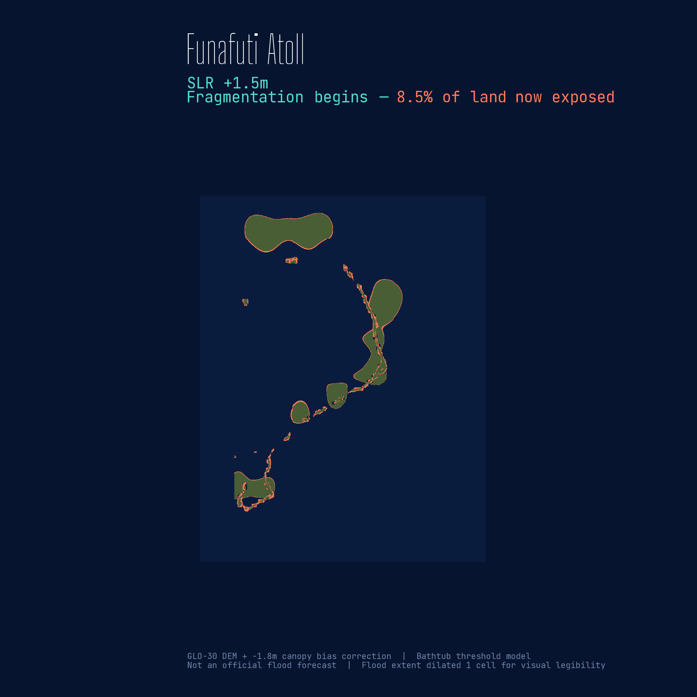

# What Sits in the Difference

<p align="left">
  
</p>

**Funafuti, Tuvalu · sea-level rise thresholds**
**Pacific Dataviz Challenge 2026 · Theme: Climate Change**
*Working title / repo codename: "Funafuti — The Tuvalu Threshold"*

> *"For Tuvalu, the difference between 1°C and 1.5°C of warming is not a number — it's the island."*

**Status:** Submitted to the Pacific Dataviz Challenge 2026 — International Global Mention category

**Live URL:** [what-sits-in-the-difference.netlify.app](https://what-sits-in-the-difference.netlify.app)

**Case study:** [The build write-up — analysis, editorial decisions, and implementation](https://stevenponce.netlify.app/projects/standalone_visualizations/sa_2026-09-02.html)

**Repo:** [github.com/poncest/pacific-dataviz-2026](https://github.com/poncest/pacific-dataviz-2026)

> **Not an official flood forecast.** This piece is a reproducible exposure-threshold analysis for the Pacific Dataviz Challenge. It is not a flood prediction, and it is not affiliated with the Pacific Community (SPC) or any government agency.

---


## Preview



*Funafuti Atoll at +1.5m sea-level rise. The connecting strips between motu begin to fragment; exposed land nearly doubles relative to the +1.0m scenario.*

---

## The story

Funafuti Atoll, home to most of Tuvalu's population, rises only a few meters above the Pacific. This scrollytelling piece shows what happens to that geography as sea levels rise — not as an abstract number, but as a visual argument: land that exists today, land whose margins fall below the line first, and land whose connectors between motu begin to fragment.

The piece opens on the airport runway — the widest flat ground on the atoll and its everyday gathering place — to fix the human scale before the maps arrive. An observed sea-surface-temperature trend grounds the warming as measured, not hypothetical; three map states show where the water reaches; a slope chart quantifies how much more; and a short coda returns to the opening thought.

Three scroll states. One place. One threshold.

---

## What this shows

| Scenario | Land area exposed |
|----------|-------------------|
| Baseline (0.0m SLR) | 0% |
| +1.0m sea-level rise | 4.5% |
| +1.5m sea-level rise | 8.5% |

The scenarios are illustrative thresholds, not precise projections for specific warming levels. The relationship between global mean temperature and sea-level rise is nonlinear and scenario-dependent; the 1.0m and 1.5m scenarios are used here as illustrative thresholds. See the [methodology](04_funafuti_tuvalu_threshold.qmd) section of the piece for full disclosures.

---

## Data sources

- **Sea-surface temperature (official SPC):** [Sea Surface Temperature anomalies (`SST_ANOM`, °C), Tuvalu, 1850–2025](https://stats.pacificdata.org/vis?lc=en&df%5Bds%5D=SPC2&df%5Bid%5D=DF_CLIMATE_CHANGE&df%5Bag%5D=SPC&df%5Bvs%5D=1.0&av=true&dq=A.SST_ANOM.&pd=,&to%5BTIME_PERIOD%5D=false) — Pacific Community (SPC) Pacific Data Hub `.Stat`, Climate Change Indicators
- **Sea level (official SPC):** [Sea Level Anomalies (`SEA_LVL`, m), Tuvalu, 1993–2023](https://stats.pacificdata.org/vis?lc=en&df%5Bds%5D=SPC2&df%5Bid%5D=DF_CLIMATE_CHANGE&df%5Bag%5D=SPC&df%5Bvs%5D=1.0&av=true&dq=A.SEA_LVL.&pd=,&to%5BTIME_PERIOD%5D=false) — Pacific Community (SPC) Pacific Data Hub `.Stat`, Climate Change Indicators
- **Elevation:** AWS Open Data Terrain Tiles — a composite global elevation model from open sources (~30 m), accessed via the `elevatr` R package
- **Coastline:** OpenStreetMap contributors, accessed via Geofabrik regional extracts through `osmextract`. Released under the Open Database License (ODbL)
- **Flood scenarios:** Derived in this work — bathtub inundation model applied to the bias-corrected DEM at three thresholds (0.0m, 1.0m, 1.5m SLR)
- **Bias correction:** −1.8m uniform canopy offset applied to all land pixels (global terrain models represent the reflective surface, including vegetation, and so overestimate bare-earth elevation; the correction is uniform and approximate)
- **Display note:** Flood pixels dilated one grid cell outward for visual legibility; subtitle percentages reflect the methodologically correct threshold without this expansion

**Elevation references:**
- Yamano, H., Cabioch, G., Chevillon, C., & Join, J. L. (2007). *Late Holocene sea-level change and reef-island evolution in New Caledonia*. Geomorphology.
- Tuck, M. E., Kench, P. S., Ford, M. R., & Masselink, G. (2019). *Physical modelling of the response of reef islands to sea-level rise*. Geology.

### Official dataset requirement (Pacific Dataviz Challenge)

The rules require at least one dataset from the official Pacific Data Hub list. This submission uses **two** official SPC Pacific Data Hub (`.Stat`) Climate Change Indicators datasets for Tuvalu — **Sea Surface Temperature anomalies** and **Sea Level Anomalies** — which supply the observed-warming context behind the exposure scenarios.

Five SPC coastal-flood datasets (Tuvalu ARI100 SLR coastal flood maps, building impact from coastal inundation, annual average loss) were evaluated for direct integration but are access-restricted (WMS preview only, CC BY-NC-SA with access controls), so they are not used in this open, reproducible pipeline. The elevation and coastline analysis runs entirely on open data (AWS Terrain Tiles via `elevatr` + OpenStreetMap).

---

## Stack

| Tool | Role |
|------|------|
| R · terra · sf · elevatr · osmextract | Spatial pipeline |
| ggplot2 · ggtext · tidyterra · patchwork | Map & chart rendering |
| showtext | Typography |
| Quarto · Closeread v1.0.1 | Scrollytelling |
| CSS | Pacific Currents visual system |

---

## Reproduce

```bash
# 1. Clone the repo
git clone https://github.com/poncest/pacific-dataviz-2026.git
cd pacific-dataviz-2026

# 2. Run the spatial pipeline (in R, in order)
# scripts/01_funafuti_data_check.R
# scripts/01b_bias_correction.R
# scripts/02_threshold_derivation.R
# scripts/03_visual_language_refinement.R   # branded map states
# scripts/05_supporting_chart.R             # exposure slope chart
# scripts/06_observed_signals.R             # observed SST trend chart

# 3. Render the scrollytelling piece
quarto render 04_funafuti_tuvalu_threshold.qmd
```

**Note:** Fonts load from Google Fonts — no local font files required.
**Note:** `_extensions/qmd-lab/closeread/` is included in the repo — no separate install needed.

---

## Visual system 

**Pacific Currents** — a dark visual language built for this piece.

| Role | Color |
|------|-------|
| Page background | `#07142F` abyss |
| Dry land | `#4A5E35` dark olive |
| Flood exposure | `#FF7A59` coral |
| Accent / labels | `#4FE0CC` reef teal |
| Body text | `#F2EDE2` sand |

---

## Licence

This work — text, code, derived data, and visualisations — is released under the [Creative Commons Attribution 4.0 International (CC BY 4.0)](https://creativecommons.org/licenses/by/4.0/) licence. You are free to share and adapt the work with attribution to Steven Ponce.

The full licence text is in [`LICENSE`](LICENSE).

This licence is conformant with the [Open Definition](https://opendefinition.org/) as required by the Pacific Dataviz Challenge rules (§4h).

**Note on OpenStreetMap data:** OSM data used in the rendering pipeline is licensed under the Open Database License (ODbL) and remains so. The CC BY 4.0 licence above applies to the derived visualisations, code, and analysis — not to any republished OSM-derived geometry. No OSM-derived geometry is currently published as a derivative dataset in this repository.

---

## Author

**Steven Ponce** · Data Analyst & R/Shiny Developer

[LinkedIn](https://www.linkedin.com/in/stevenponce/) ·
[Bluesky](https://bsky.app/profile/sponce1.bsky.social) ·
[GitHub](https://github.com/poncest) ·
[stevenponce.netlify.app](https://stevenponce.netlify.app)

---

*Pacific Dataviz Challenge 2026 · Theme: Climate Change · Submission window: June 1 – August 31, 2026*
